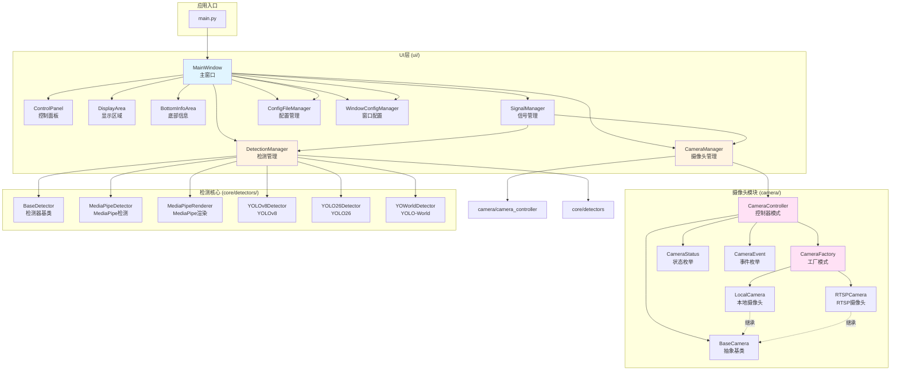
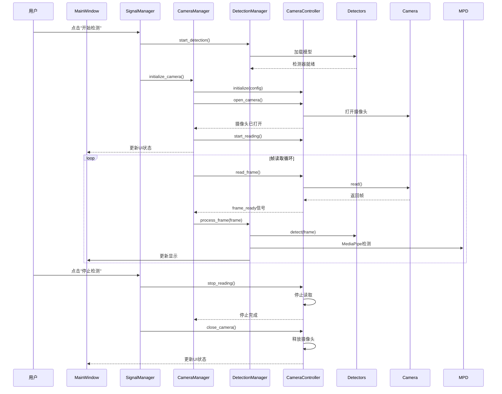

# YOLO实时检测识别系统

基于YOLO和MediaPipe的实时目标检测系统，支持目标检测、姿态识别和表情分析。

## 📑 目录

- [主要特性](#-主要特性)
- [快速开始](#-快速开始)
- [项目架构](#-项目架构)
  - [整体架构](#整体架构)
  - [调用流程](#调用流程)
  - [职责划分](#职责划分)
- [项目结构](#-项目结构)
- [使用示例](#-使用示例)
- [开发指南](#-开发指南)
- [故障排除](#-故障排除)

---

## ✨ 主要特性

- 🎯 **多模型支持**: YOLOv8、YOLO26、YOLO-World
- 🤸 **姿态检测**: 基于MediaPipe的人体姿态识别
- 😊 **表情分析**: 基于MediaPipe的面部表情检测
- 📹 **多源摄像头**: 本地摄像头、RTSP网络摄像头
- 🖼️ **实时显示**: 高性能的视频流处理
- 🎨 **图形化界面**: PyQt5实现，完美支持中文
- 🏗️ **清晰架构**: 模块化设计，职责分离，易于扩展
- 📊 **可视化文档**: 完整的架构图和调用流程

## 🚀 快速开始

### 环境要求

- Python 3.10（推荐，兼容性最佳）
- OpenCV 4.8+
- PyQt5 5.15+
- MediaPipe 0.10+
- Ultralytics 8.0+
- PyTorch 2.0+（CPU版本）

**注意**：Python 3.13+与PyTorch存在兼容性问题，推荐使用Python 3.10。

### 安装依赖

```bash
# 安装基础依赖
pip install -r requirements.txt

# 安装PyTorch (CPU版本)
pip install torch torchvision torchaudio --index-url https://download.pytorch.org/whl/cpu
```

### 运行程序

```bash
python main.py
```

## 🏗️ 项目架构

### 整体架构

项目采用三层架构设计，简洁清晰，易于理解和扩展：



### 调用流程



### 职责划分

| 模块 | 职责 | 说明 |
|------|------|------|
| **MainWindow** | UI容器和协调者 | UI初始化、组件管理、配置加载/保存、UI更新方法 |
| **SignalManager** | 信号管理 | 纯信号连接、简单事件处理（复选框、按钮） |
| **CameraManager** | 摄像头管理 | UI层与CameraController交互、帧读取定时器控制 |
| **DetectionManager** | 检测管理 | 检测流程编排、模型加载、帧处理和渲染 |
| **CameraController** | 摄像头控制 | 摄像头生命周期管理、状态转换、事件通知（核心模块）|
| **BaseCamera** | 摄像头抽象 | 定义统一的摄像头接口和抽象方法 |
| **CameraFactory** | 摄像头工厂 | 创建不同类型的摄像头实例 |
| **Detector** | 检测器 | YOLO/MediaPipe检测（核心模块）|
| **ConfigFileManager** | 配置文件管理 | 配置文件的加载和保存 |
| **WindowConfigManager** | 窗口配置管理 | 窗口配置的设置和恢复 |

## 📂 项目结构

```
RealTimeRecognize/
├── main.py                      # 应用入口
├── config.json                  # 配置文件
├── requirements.txt             # 依赖列表
├── README.md                    # 项目文档
│
├── camera/                      # 摄像头核心模块
│   ├── __init__.py
│   ├── base_camera.py           # 摄像头抽象基类
│   ├── camera_controller.py    # 摄像头控制器
│   ├── camera_factory.py        # 摄像头工厂
│   ├── enum/                    # 枚举定义
│   │   ├── __init__.py
│   │   ├── camera_event.py      # 摄像头事件
│   │   └── camera_status.py     # 摄像头状态
│   └── implementations/         # 具体实现
│       ├── __init__.py
│       ├── local_camera.py      # 本地摄像头
│       └── rtsp_camera.py       # RTSP摄像头
│
├── core/                        # 检测核心模块
│   ├── __init__.py
│   └── detectors/               # 检测器
│       ├── __init__.py
│       ├── base.py              # 检测器基类
│       ├── mediapipe/           # MediaPipe
│       │   ├── __init__.py
│       │   ├── manager.py       # MediaPipe管理器
│       │   ├── detector.py      # 检测器
│       │   └── renderer.py      # 渲染器
│       └── yolo/                # YOLO系列
│           ├── __init__.py
│           ├── yolo8.py         # YOLOv8
│           ├── yolo26.py        # YOLO26
│           └── yolo_world.py    # YOLO-World
│
├── ui/                          # UI层
│   ├── __init__.py
│   ├── main_window.py              # 主窗口（UI容器）
│   │
│   ├── managers/                   # 管理器
│   │   ├── __init__.py
│   │   ├── camera_manager.py       # 摄像头管理
│   │   ├── detection_manager.py    # 检测管理
│   │   ├── signal_manager.py       # 信号管理
│   │   ├── config_file_manager.py  # 配置文件管理
│   │   └── window_config_manager.py # 窗口配置管理
│   │
│   └── components/              # UI组件
│       ├── __init__.py
│       ├── control_panel.py     # 控制面板
│       ├── display_area.py      # 显示区域
│       └── bottom_info_area.py  # 底部信息
│
└── model/                       # 模型文件
    ├── yolo8/
    ├── yolo26/
    └── yoloworld/
```

## 💡 使用示例

### 通过GUI使用

1. **启动程序**: `python main.py`
2. **选择模型**: 从下拉菜单选择YOLO模型
3. **配置摄像头**:
   - 本地摄像头：选择摄像头ID
   - RTSP摄像头：选择"RTSP网络摄像头"，输入IP地址
4. **启用功能**（可选）:
   - ☑️ 姿态检测 - 检测人体姿态
   - ☑️ 骨骼显示 - 显示人体骨架
   - ☑️ 表情检测 - 检测面部表情
   - ☑️ 镜像模式 - 水平镜像显示
5. **点击"启动检测"**

### RTSP摄像头配置

**通过GUI**:
1. 在"摄像头设置"中选择"RTSP网络摄像头"
2. 输入IP地址（如: 192.168.1.100 或 192.168.1.100:8554）
3. 点击"启动检测"

**常见RTSP格式**:
- 本程序默认: `rtsp://ip:8554/`
- 海康威视: `rtsp://username:password@ip:554/Streaming/Channels/101`
- 大华: `rtsp://username:password@ip:554/cam/realmonitor?channel=1&subtype=0`
- 通用: `rtsp://ip:port/stream`

## 🔧 开发指南

### 添加新的检测器

1. 继承`BaseDetector`类
2. 实现必要方法
3. 在`core/detectors/`中创建模块
4. 更新`core/detectors/__init__.py`

```python
from core.detectors.base import BaseDetector

class MyDetector(BaseDetector):
    def __init__(self, model_path):
        super().__init__(model_path)

    def load_model(self):
        """加载模型"""
        self.model = load_my_model(self.model_path)

    def detect(self, frame, verbose=True):
        """执行检测"""
        return self.model(frame)

    def get_classes(self):
        """返回类别"""
        return ['class1', 'class2']
```

### 添加新的摄像头类型

1. 继承`BaseCamera`类
2. 实现抽象方法
3. 在`camera/implementations/`中创建实现
4. 在`CameraFactory`中注册

```python
from camera.base_camera import BaseCamera
from typing import Tuple, Optional, Dict, Any
import numpy as np

class MyCamera(BaseCamera):
    def __init__(self, camera_id: int):
        super().__init__()
        self.camera_id = camera_id

    def open(self) -> bool:
        """打开摄像头"""
        # 实现打开逻辑
        self._is_opened = True
        return True

    def read(self) -> Tuple[bool, Optional[np.ndarray]]:
        """读取帧"""
        # 实现读取逻辑
        ret = True
        frame = None  # 从摄像头读取帧
        return ret, frame

    def release(self) -> None:
        """释放资源"""
        # 实现释放逻辑
        self._is_opened = False

    def is_opened(self) -> bool:
        """检查摄像头是否已打开"""
        return self._is_opened

    def get_resolution(self) -> Tuple[int, int]:
        """获取摄像头分辨率"""
        return self._width, self._height

    def get_statistics(self) -> Dict[str, Any]:
        """获取摄像头统计信息"""
        return {
            'fps': 0,
            'frame_count': self._frame_count,
            'error_count': self._error_count,
            'resolution': (self._width, self._height)
        }
```

### 扩展UI功能

**添加新的UI组件**:
1. 在`ui/components/`中创建组件类
2. 在`MainWindow`中初始化组件
3. 在`SignalManager`中连接信号

**添加新的配置项**:
1. 在`config.json`中添加配置
2. 在`MainWindow`中加载/保存配置
3. 在UI组件中添加控制

## 🐛 故障排除

### PyTorch DLL加载失败

**问题**: `OSError: [WinError 1114] 动态链接库(DLL)初始化例程失败`

**原因**: Python 3.13与PyTorch不兼容

**解决**: 使用Python 3.11

```bash
# 创建Python 3.11虚拟环境
python3.11 -m venv venv
source venv/bin/activate  # Linux/Mac
venv\Scripts\activate  # Windows

# 安装依赖
pip install -r requirements.txt
pip install torch torchvision torchaudio --index-url https://download.pytorch.org/whl/cpu
```

### 模型加载失败

**问题**: `模型加载失败` 或文件不存在

**解决**:
1. 检查`model/`目录下是否有模型文件
2. 确认模型文件完整
3. 检查文件路径是否正确

### RTSP无法连接

**问题**: 无法连接到RTSP流

**解决**:
1. 检查IP地址是否正确
2. 确保设备和电脑在同一网络
3. 检查防火墙设置
4. 验证RTSP端口是否开放（554, 8554等）
5. 使用FFmpeg测试: `ffplay rtsp://ip:port/stream`

### MediaPipe导入失败

**问题**: `ImportError: No module named 'mediapipe'`

**解决**:
```bash
pip install mediapipe==0.10.32
```

### 导入错误

**问题**: `ModuleNotFoundError`

**解决**:
1. 确保在项目根目录运行
2. 检查Python版本（推荐3.11）
3. 重新安装依赖: `pip install -r requirements.txt`

## 📚 架构设计原则

本项目遵循以下设计原则：

1. **简洁实用** - 避免过度设计，保持简单清晰
2. **职责分离** - 每个模块职责明确，避免耦合
3. **模块化** - 高内聚低耦合，易于扩展
4. **依赖方向** - UI层 → 控制器层 → 核心层
5. **设计模式** - 工厂模式、管理器模式、适配器模式

## 🤝 贡献

欢迎贡献代码、报告问题或提出建议！

## 📄 许可证

本项目仅供学习和研究使用。

## 🎉 致谢

感谢以下开源项目：
- [Ultralytics YOLO](https://github.com/ultralytics/ultralytics)
- [MediaPipe](https://github.com/google/mediapipe)
- [PyQt5](https://www.riverbankcomputing.com/software/pyqt/)
